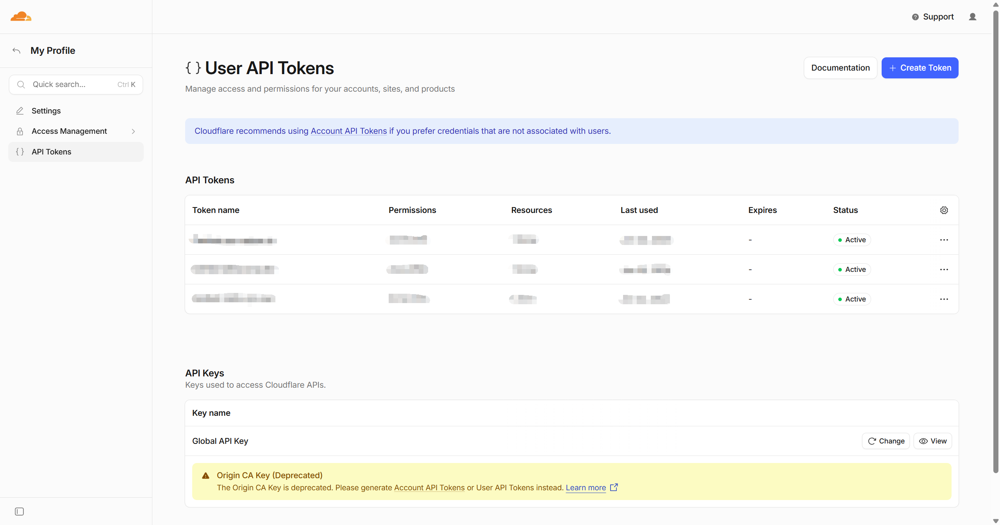
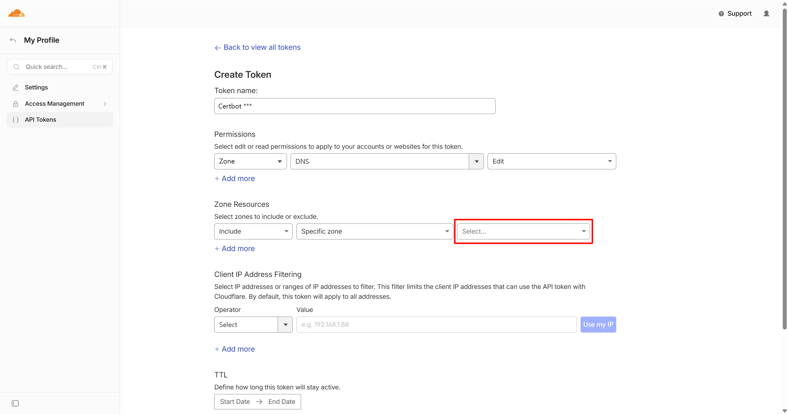



在 HTTPS 普及的当下，为自己的网站申请证书已经是一件必做的事情。
比起某些价格不菲的付费证书，由 [Let's Encrypt](https://letsencrypt.org/) 提供的免费证书显然是更适合普通人的选择。
本文中将介绍如何结合 Certbot 和 Let's Encrypt 为托管在 Cloudflare 上的域名申请免费证书，以及相关的容易踩的坑。

本文参考了Sindastra 的[这篇博文](https://www.sindastra.de/p/3151/how-to-set-up-certbot-lets-encrypt-with-cloudflare-dns)，在此表示感谢。

*另由于个人习惯，本文中将 `.com` 称为一级域名，而 `example.com` 称为二级域名，以此类推。*

## 准备依赖项

首先你需要在你的服务器上安装 Certbot 和其对接 Cloudflare DNS 的扩展。

以 Debian 和 Ubuntu 为例：

```sh
apt update
apt install certbot python3-certbot-dns-cloudflare
```

其次（当然了）你需要有一个域名，并且这个域名被托管在了 Cloudflare 上。

## 创建用于更改 DNS 设置的 API token

为了验证**你**确实是域名的控制者，Let's Encrypt 在颁发证书前会发起一次 [DNS-01 challenge](https://letsencrypt.org/docs/challenge-types/#dns-01-challenge)。
Certbot 需要能够向你的域名加入 TXT 记录才能够完成验证。因此你需要在 Cloudflare 中创建一个 API token，以便 Certbot 自动加入验证用的 TXT 记录。

在 Cloudflare 控制台中进入个人主页，找到 “API Tokens”。



点击右上角的 “Create Token”，选择 “Edit zone DNS” 模板。



在模板中选择对应的域名（只需选择一级域名）。当然也可以添加 IP 过滤器，视个人情况设置。

随后你就能得到一个 API token。**切记**妥善保管这个 token，因为一旦泄露就代表着别人得到了你的域名的控制权。

## 运行 Certbot 请求证书

拿到 API token 后，便可将其上传到服务器上，例如：

```sh
mkdir -p /etc/cloudflare
chmod 700 /etc/cloudflare
touch /etc/cloudflare/example.com.ini
chmod 600 /etc/cloudflare/example.com.ini
nano /etc/cloudflare/example.com.ini
```

在 `example.com.ini` 中写入：

```ini
dns_cloudflare_api_token = ${API_TOKEN}
```

可以注意到我们这里严格控制了非当前用户对 token 文件的访问权限。这么做无非是出于安全考量，一般建议将这份文件设为仅 root 可读写。

随后执行：

```sh
certbot certonly --register-unsafely-without-email \
    --dns-cloudflare \
    --dns-cloudflare-credentials /etc/cloudflare/example.com.ini \
    -d example.com -d '*.example.com' \
    --dns-cloudflare-propagation-seconds 60 \
    --deploy-hook '/usr/bin/systemctl reload nginx'
```

可以注意到我们申请的证书覆盖了 `example.com` 和其下的二级域名 `*.example.com`。如果你只需要为单一域名申请证书，可以按需更改。

在这里 `dns-cloudflare-propagation-seconds` 主要用于在完成 DNS 更改后等待 DNS 记录被同步到全球的服务器上。对于 Cloudflare 来说 60 秒已经足够。

Certbot 会自动续期证书，而 `deploy-hook` 对在更新证书后重载服务端（比如 nginx）十分有用。如果你使用别的 HTTP server，也可以自行替换重启命令。

随后便可以在 HTTP server 中加载证书了。以 nginx 为例：

```nginx
server {
    listen 443 ssl;
    server_name example.com;

    ssl_certificate     /etc/letsencrypt/live/example.com/fullchain.pem;
    ssl_certificate_key /etc/letsencrypt/live/example.com/privkey.pem;
    include /etc/letsencrypt/options-ssl-nginx.conf;
    ssl_dhparam /etc/letsencrypt/ssl-dhparams.pem;

    # ...
}

server {
    listen 80;
    server_name example.com;

    return 301 https://$host$request_uri;
}
```

笔者不是很确定 `options-ssl-nginx.conf` 和 `ssl-dhparams.pem` 这两个文件在默认配置下是否会自动生成。但就算没有的话也可以从在 [Certbot 官方仓库](https://github.com/certbot/certbot)中找到，
分别位于：

```
~/certbot/src/certbot/_internal/plugins/nginx/tls_configs/options-ssl-nginx.conf
~/certbot/src/certbot/ssl-dhparams.pem
```

或是干脆回退到基础的 SSL 配置，如 `ssl_protocols TLSv1.2 TLSv1.3;`。

## 注意事项

虽然 Let's Encrypt 可以为任何层级的域名颁发证书，但 Cloudflare 免费版提供的 Universal SSL 证书无法覆盖四级及以上的域名。
这意味着 `example.com` 和 `*.example.com` 可以使用 Cloudflare 的反向代理服务，但 `*.*.example.com` 便会出现证书错误。

想要解决这个问题只有两种方法：付费或关闭反代功能，而对于普通开发者而言两者显然均不划算。最好的方法还是在设计域名时避免出现四级及以上的长域名。

另外便是老生常谈的 token 安全问题。事实上由于我们使用的是 DNS challenge，用于申请证书的服务器并不需要也是真正提供服务的服务器。
我们完全可以在一台足够安全的机器上申请证书，然后将证书分发到别的服务器上。但这并非本文重点，所以在此不做赘述。