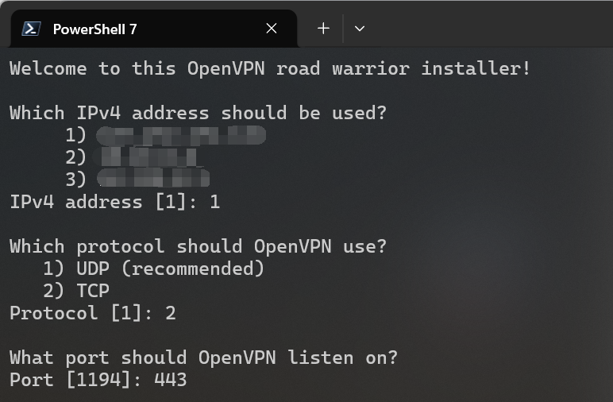
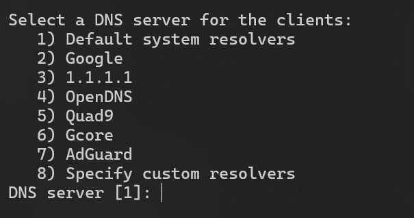
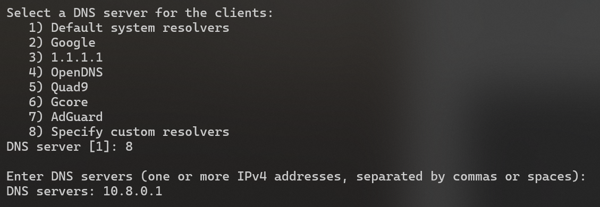



在许多校园网环境中，或多或少都会遇到类似于“游戏端口被封”、“校园网内部 DNS 污染”等问题。

笔者所在的学校算是一个较为极端的例子：根据扫描结果，无论 TCP 还是 UDP 协议，超过 1024 的端口如非必要几乎都被屏蔽。
同时在校园网关进行的 DNS 污染严重到甚至让 GitHub 都无法正常打开。在这种情况下，“翻墙”就是几乎唯一的选择。

本文将详细记述笔者使用的校园网穿透配置，并且适当探讨部分设置的利弊。

***请注意：笔者的网络环境位于国外，故本文所有内容不考虑 GFW 封锁问题。***

## VPN 套件选择

目前主流的VPN套件和协议有很多种：从穿透 GFW 常用的 V2Ray 和 Shadowsocks，到 WireGuard，以及笔者最后选择的 OpenVPN。

应该说，不同的选择有不同的好处。笔者自己也有搭建基于 V2Ray+VMess/VLess 的自用 VPN，但这种技术栈在不同种类的终端上使用的客户端并不统一，
并且对“小白”用户来说界面并不友好（因为笔者的校园网穿透同时也提供给别的同学使用，因此也需要考量易用性）；
而 WireGuard 的劣势相信对该协议有所了解的读者都不难想到，即其完全依赖 UDP 传输，在部分网络受限环境下可能无法使用。

那么笔者最后选择 OpenVPN 的原因也就显而易见了：并不算复杂的配置，完全基于虚拟网卡（不用像 V2Ray 一样额外配置 TUN），
可以自行选择传输层协议和端口，有现成的、成熟的管理脚本和多端统一、由官方维护的简易客户端，几乎完美契合了笔者的需求。
即便带来了相对大的服务端 CPU 开销，但这些负载对现代 VPS 来说一般不成问题。

当然，选择 OpenVPN 的前提是校园网内没有部署深度包检测（DPI），因为其流量特征过于明显，在 DPI 技术面前几乎等于自杀。在这种情况下，
建议换用如 V2Ray 等基于流量伪装设计的技术栈，本文对此不作赘述。

## 安装 OpenVPN

笔者选用了 GitHub 上的 [Nyr/openvpn-install](https://github.com/Nyr/openvpn-install) 项目进行安装和后期的管理。

在终端中运行以下命令安装：

```sh
wget https://git.io/vpn -O openvpn-install.sh && bash openvpn-install.sh
```

随后依次选择使用的 IP，协议，端口（此处按照笔者需求选择 TCP 协议和 443 端口）：



再然后就是相对重要的一点：选择 DNS 服务。

为了彻底避免校园网内 DNS 污染，我们需要在服务器配置中加上 `push "block-outside-dns"` 强制客户端使用指定的 DNS（安装脚本已经自动加上了该项配置）。
但这也意味着我们必须手动选择一个合适的 DNS 服务。

笔者一般建议选择谷歌或是 Cloudflare 的 DNS，但也可以结合 Dnsmasq 进行高阶配置（见）。



再随后只需要给第一个 Client 取一个名字，便会自动进行安装。

完成安装后，再次运行 `openvpn-install.sh` 脚本便可进行 Client 管理和卸载 OpenVPN，对此本文不再赘述。

## 在客户端中导入 Profile

不像别的技术栈，由 OpenVPN 官方维护的客户端 OpenVPN Connect 可以说在使用上傻瓜到了极致。
用户只需要将服务器上的 Profile（`.ovpn` 文件）下载下来，并且在 OpenVPN Connect 中导入便可连接服务器，
几乎不会有犯错的地方。

在完成导入后，只要能够正常看到绿色的 Connected 字样，便代表已经连接成功。此时电脑的所有流量都会经由 OpenVPN 代理。

这也是笔者选择 OpenVPN 的一大原因：极简的客户端大大降低了“小白”的学习成本，让笔者几乎不用在别的用户（同学）的设备上操作。
在导入 Profile 后，所有的问题基本上都不用再在客户端更改设置，若真的需要也一般都是直接删除服务器重新导入配置。

## 笔者自建的管理界面

为了更方便地管理 OpenVPN 服务，笔者自己编写了一套运行在 CLI 下的管理界面。

但由于代码写得实在太糙了，为了快速上线没有严谨设计导致满是屎山，又在“能跑就别动”的指导方针下放弃了重构计划，所以在此处便不作深入探讨。

读者若感兴趣可以查看在 GitHub 上的 [Ace-Radom/openvpn-mgmt](https://github.com/Ace-Radom/openvpn-mgmt) 和
[Ace-Radom/openvpn-mgmt-web](https://github.com/Ace-Radom/openvpn-mgmt-web) 两个仓库，
分别是服务器管理界面和 Profile 申请/管理的网站。~~真的很糙，建议别看代码。~~

本节仅略谈部分在管理界面中用到的 OpenVPN 功能。

### OpenVPN Management Interface

注意这个管理界面和笔者编写的管理界面不同，是 OpenVPN 的内置功能。为了开启这个功能，需要在服务器配置文件中加上：

```
management 127.0.0.1 5555 mgmt_pswd.txt
```

其中 `5555` 是管理界面监听的端口号，`mgmt_pswd.txt` 则是和服务器配置文件放于同一目录下的用于存放管理界面密码的文本文件。

这个管理界面功能相当强大，笔者自己的管理界面中许多功能也基于该 Interface 实现，例如：

* 实时状态监控（`status`）
* 强制断线（`kill`）

当然这些远远不是其所有的功能，读者可以自行查阅[社区文档](https://openvpn.net/community-docs/management-interface.html)。

### OpenVPN Server-Side Script

虽然在 Management Interface 内也可以做到身份验证的功能，但比起直接挂载服务端脚本来说复杂度过高。为此笔者编写了一套脚本，
用于在服务启动/关闭时轮转日志，并在用户连接时进行身份验证、在断开时记录网络使用量以方便审计。

```
script-security 2
up script/up.sh
down script/down.sh
client-connect script/client_connect.sh
client-disconnect script/client_disconnect.sh
```

其中 `client-connect` 脚本通过返回值验证授权：若返回值为 0 则认定通过，否则则不通过。
这个功能与前文提到的强制断线功能结合使用，便可以做到类似于屏蔽恶意用户的功能，或是在服务器维护中阻止所有用户连接。

其余脚本在笔者的用例中均只有简单的日志记录功能，在此不做过多讨论。

## 可选：基于 Dnsmasq 的域名屏蔽 {#dnsmasq}

有些时候，我们不希望让电脑上的程序去访问某些 URL。通常我们通过更改系统 hosts 文件将域名解析到本地来实现这个功能，
但 hosts 文件在功能上有诸多限制（例如不支持通配符），且作为系统文件修改需要管理员权限，也进一步降低了易用性。

前文提到，我们可以在安装 OpenVPN 服务时选择使用自建 DNS 服务。在这里我们在同一台服务器上安装 Dnsmasq，因为它极其轻量且易于配置。

我们先配置 Dnsmasq 并启动 DNS 服务：

```
# Dnsmasq Configure
listen-address=127.0.0.1,10.8.0.1
bind-interfaces
no-resolv
```

在 DNS 服务启动后，我们便可以在 OpenVPN 安装中选择使用自建 DNS 服务器，并将 DNS 服务器的 IP 设为 `10.8.0.1`。



随后在 Dnsmasq 配置中定义上游 DNS：

```
server=1.1.1.1
server=1.0.0.1
server=8.8.8.8
server=8.8.4.4
```

完成这些步骤并重启 Dnsmasq 服务后，若在客户端上可以正常解析域名，则代表配置正确。

我们可以按照以下方式添加配置以屏蔽部分域名：

```
address=/block.site/127.0.0.1
```

需要注意的是：即便我们在这里没有使用通配符，所有挂载在 `block.site` 下的次级域名一样会被解析到本地。
这是由 Dnsmasq 的设计决定的：由于其仅支持泛解析而没有实现精确匹配，想要简单地做到类似于“仅屏蔽某个二级域名，却不屏蔽其下的三级域名”的功能是不可能的。

在某些场合这可能是一种限制，但更多的时候这就是我们想要的功能。而在什么情况下会需要这种大范围屏蔽某一域名及其下所有次级域名呢？
此处不便细说，请读者自行联想。

## 可选：通过多服务器架构绕过网站屏蔽

如今许多网站会依赖由如 Cloudflare 等公司提供的安全保护服务，其中一种惯用策略便是按 IP 段或地理位置等信息屏蔽某些访问请求。
不巧的是，由于我们的 OpenVPN 服务器大多部署在 VPS 上，且这些一般配置的 VPS 也常被网络爬虫/扫描服务租用。
因此，我们的 VPS 所在的 IP 段被网站错误屏蔽并非很罕见的情况。而由于我们的所有流量都会被 OpenVPN 代理，
所以一旦在我们的设备上连接了 OpenVPN 服务器，我们就无法打开这些本来可以打开的网页了。

解决这个问题的简单方法也十分纯粹：将这些被屏蔽的流量分离出来，由另外的一台没有被网站屏蔽的服务器转发。
由于我们已经安装了 Dnsmasq 并与 OpenVPN 配套使用，所以实现这个功能并不困难。

假定目前有两台服务器：

* 代理服务器 A：安装了 OpenVPN 和 Dnsmasq，但被网站错误屏蔽。
* 转发服务器 B：没有被网站屏蔽。

我们首先在服务器 A 上创建一个 IP Set，用于存储所有需要被转发到服务器 B 上的 IP。

```sh
ipset --create proxy_domains hash:ip --timeout 3600
```

其中强烈建议加上 `--timeout` 开关以自动淘汰长时间未被访问的 IP。原因见下文。

之后我们需要利用 Iptables 设定转发逻辑（可按实际情况调整转发端口，此处使用 8443）：

```sh
iptables -t nat -A PREROUTING -s 10.8.0.0/24 -p tcp --dport 443 -m set --match-set proxy_domains dst -j DNAT --to-destination ${SERVER_B_IP}:8443
iptables -t nat -A POSTROUTING -d ${SERVER_B_IP} -p tcp --dport 8443 -j MASQUERADE
```

然而实验发现，Cloudflare 获取到的仍然是服务器 A 的真实 IP，因而再次触发屏蔽机制。
其中主要原因是 Cloudflare 的保护服务已经默认启用了 HTTP/3 协议，而其使用基于 UDP 传输的 QUIC 协议实现。由于我们只拦截了 TCP 流量，
所以服务器 A 的真实 IP 依然能被 Cloudflare 获取到。

虽然我们也能转发 UDP 流量，但这对服务器 B 上运行的转发服务有要求且配置上更加复杂，最简单的解法是迫使连接退回到 TCP 协议：

```sh
iptables -I FORWARD -s 10.8.0.0/24 -p udp --dport 443 -m set --match-set proxy_domains dst -j REJECT
```

完成以上配置后切记执行持久化保存（Debian 系一般使用 ipset-persistent 和 iptables-persistent，并调用 `netfilter-persistent save` 保存所有配置）。

在 Dnsmasq 的配置中我们只需要加上：

```
ipset=/cf_blocked.site/proxy_domains
```

Dnsmasq 会自动将解析出的 IP 加入对应的 IP Set 中，随后所有连接到对应 IP 的流量都会被内核转发到服务器 B。

而在服务器 B 上，由于其只作流量转发用途，理论上可以使用任何 TCP 流量中转工具（如 sniproxy 和 GOST）。
在笔者的环境中，由于服务器 B 上已经运行了 Nginx 并配置了 stream 模块，因此采用了这种看上去有些臃肿的组合。

首先，我们需要先确定服务器 B 上的 IPv4 转发功能是否启用。

```sh
# 检查 IPv4 转发功能是否启用
sysctl net.ipv4.ip_forward

# 若没有启用 则运行以下命令开启
echo "net.ipv4.ip_forward = 1" >> /etc/sysctl.conf
sysctl -p
```

然后便是按照个人选择配置转发服务。这里附上笔者的 Nginx stream 模块配置：

```nginx
stream {
    resolver 1.1.1.1 8.8.8.8 valid=300s;
    server {
        listen 8443;
        ssl_preread on;
        proxy_pass $ssl_preread_server_name:443;
        allow ${SERVER_A_IP};
        deny all;
    }
}
```

在 Nginx 配置中切记对转发来源 IP 加以限制。
为了方便审计，我们一般还需要加上 Access Log。由于这不是本文的重点，故不做阐述。

这种转发仅有一个问题：由于我们的底层转发逻辑是按照 IP 匹配的，而那些真的会屏蔽服务器 A 的网站大概率都会使用 Cloudflare 等公司的代理服务。
也就是说，我们解析到并加入转发 IP Set 的 IP 实际上大概率是 CDN 的 IP，而非网站真实服务器的 IP。

这会造成一个限制：由于所有依赖于这种代理服务的网站都可能被解析到这些 CDN 上，可能会出现在访问完一个被屏蔽的网站后，
别的正常网站由于被解析到了相同 CDN IP 因此也被转发到了服务器 B 上。

这类误转发在当前架构下，在我的认知范围内是无解的。因为一旦按照域名转发就会极大增加复杂度和性能开销，而这是笔者不期望的。
因此笔者建议在创建 IP Set 时引入 Timeout 机制，在规定时间后自动淘汰被解析的 CDN IP，以避免越来越多的网站被错误转发。

而 Timeout 的具体值则按服务器 A 与服务器 B 之间的物理距离决定：
笔者一般将与代理服务器（服务器 A）处在同一地区的转发服务器（服务器 B）的 Timeout 设为 12 小时（即 43200 秒）。
若两者相距很远（如代理服务器在欧洲而转发服务器在香港），则建议设定为一小时甚至更短，以避免误解析造成的延迟激增。

**2026-05-13 Update**：在五月十二日，笔者配置的转发突然部分失效。在浏览器上记录到了一个很诡异的现象：当网页冷加载时，
浏览器可以正确获取到网页的根 HTML，但在随后加载资源的过程中连接被 Cloudflare 识别到代理服务器真实 IP 并被屏蔽，导致网页上大量内容缺失。
在点击刷新后则彻底无法访问网站内容。

根据排查得知这是 Cloudflare Insights 服务造成的。在冷加载中，有些网站会注入这项性能监测服务脚本，而该脚本是直接从 Cloudflare 的域名下拉取的。
由于我们没有对该域名做任何限制，相关流量自然也没有被路由到转发服务器上。笔者怀疑 Cloudflare 在后台更新了他们的安全策略，
会将请求该脚本的 IP 和请求网页内容的 IP 进行比较，并优先采信被网站安全规则屏蔽的 IP。由于时间原因笔者没有办法进一步详细调查，
也无法确定受影响的网站在之前是否有被注入 Cloudflare Insights 相关脚本，但鉴于在阻断了该脚本的拉取后相关问题便得以解决，
并且那些没有被注入的网站也没有受到影响，基本可以确定该脚本和本次事件有关。

为规避相关风险，笔者在此不详细说明解决方法。鉴于所有需要的技术细节在本文中都有讨论且本文读者应该都具备对相关技术的一定了解，
笔者相信根据本文内容找出合适的解决方案对读者来说绝非难事。